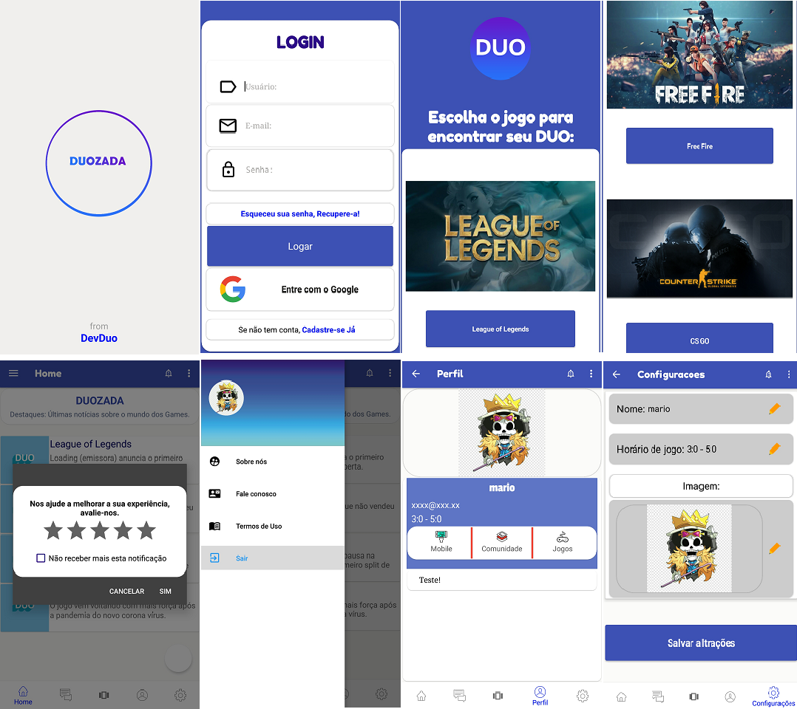
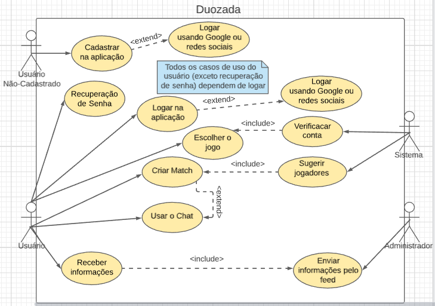
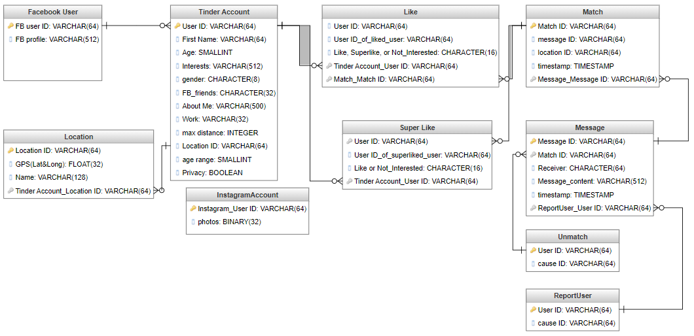

<h1>DUOZADA</h1>

A criação de um aplicativo mobile para dar auxílio dos jogadores multiplayers onlie de interação e competiticidade.

Para ver todos e com mais detalhes clique <a href="https://drive.google.com/drive/folders/19lLdHaKgz9R5O3Z6H8n3G6-OekDtKsU-?usp=sharing">aqui.</a>

<h2>Sobre o aplicativo...</h2>

O aplicativo Duozada, vem para ajudar os jogadores de jogos multiplayer online para encontrarem outros jogadores.

<h3>Por que?</h3>

Foi analisado que dentro do ambiente virtual, são comuns problemas de relação entre jogadores e com a plataforma, exemplo disso, o desbalanceamento na criação de partidas que é feito automaticamente pela plataforma do jogo (Pareamento - Matching).
Visando solucionar, este trabalho tem por finalidade a criação de uma plataforma que auxilie os jogadores online na criação de partidas e no desenvolvimento do jogador e da comunidade, competitividade, dado os problemas causados pelo desbalanceamento na criação de partidas automáticas.

<h3>Justificativa</h3>

O sistema de busca de jogadores em ambientes de games multiplayer online é muitas
vezes desigual, por não dar ênfase nos níveis dos jogadores, mas sim na criação cada
vez mais rápida das partidas, resultando em partidas desiguais. Visando acabar com
esse problema, a criação de um aplicativo para encontrar pessoas com níveis de
habilidades parecidos com o do usuário, com o intuito que as partidas fiquem mais
niveladas.

<h3>Hipótese</h3>

Um grande número de jogadores enfrenta problemas em relação aos seus jogos
online (competitivo), encontrando partidas desbalanceadas, com isso cria uma
dificuldade para evoluir. Portanto, a criação de uma solução para auxiliar o encontro
de jogadores, com níveis parelhos, para se auxiliarem a evoluir no jogo e balanceando
os jogos.

<pre>
Crédito aos membros do Projeto:
° BRYAN SALINAS ALVARO,
° FELIPE CASTRO FERREIRA,
° JUAN PABLO OLIVEIRA LIMA,
° PEDRO HENRIQUE PEREIRA RODRIGUES,
° RYAN CASTRO FERREIRA.
</pre>
<b>LinkdIn </b>- https://www.linkedin.com/in/ryan-castro-ferreira/  
<b>Email </b>- ryancasf@gmail.com    

<h2>Documentação</h2>
<h3>Links Úteis:</h3>

Link para baixar o aplicativo no seu disposito ou emulador.  
<a href="https://drive.google.com/file/d/1CJi5zRS7cO2BxdmR74h7mBLjiQ4v6592/view?usp=sharing"><b>Download .aab</b></a> 
<a href="https://drive.google.com/file/d/1cnjA28l8QQhpRswZCnGOfpzq1CNXpGLN/view?usp=sharing"><b>Download .aia</b></a> 
<a href="https://drive.google.com/file/d/19eRKkkJbZYKeari4Qtxpj-rP8cEvqArN/view?usp=sharing"><b>Download .apk</b></a> 

<b>Apresentação e Documentação</b> 
Para ter acesso completo a Documentação do projeto clique <a href="https://drive.google.com/file/d/1aTZbS0YBQOecufmyb3bAIUYoDaDMsEES/view?usp=sharing">aqui.</a>  
Apresentação no PowerPoint do TTC, acesse-o clicando <a href="https://drive.google.com/file/d/1hULb8eFEdxTo4XTDczrdkPIYIDV1OlOE/view?usp=sharing">aqui.</a>

<h3>Diagramas</h3>

Estrutura de modelagem seguindo os padrões do UML.  
<i>"A Linguagem de Modelagem Unificada (UML) é uma linguagem visual para especificar, construir e documentar os artefatos dos sistemas. A palavra visual na definição é um ponto chave - a UML é a notação diagramática padrão, de fato, para desenhar ou apresentar figuras relacionadas a softwares."</i>(CRAIG LARMAN. Utilizando UML e padrões: Uma introdução à análise e ao projeto orientados a objetos e ao desenvolvimento iterativo - 3ª edição, 1997, pág. 39)

Diagrama de apoio (^ acima ^) do Tinder.

<h3>Canvas</h3>

<i>“Acreditamos que um Modelo de Negócios pode ser melhor descrito com
nove componentes básicos, que mostram a lógica de como uma organização
pretende gerar valor. Os nove componentes cobrem as quatro áreas
principais de um negócio: clientes, oferta, infraestrutura e viabilidade
financeira. O Modelo de Negócios é um esquema para a estratégia ser
implementado através das estruturas organizacionais dos processos e
sistemas.”</i> (OSTERWALDER, 2010, p.15).  
Veja o arquivo em pdf, clicando <a href="https://drive.google.com/file/d/1cWiYbHXC9-HB3L_8Y48hrWa90SHUNIHM/view?usp=sharing">aqui.</a>

<h3>Análise SWOT</h3>

Planejamento estratégico utilizada para auxiliar pessoas ou organizações a identificar forças, fraquezas, oportunidades, e ameaças associados a competição do mercados e dos concorrentes. 
	<i>"Não existe concorrência"</i>, Ícaro de Carvalho.    

<h3>Wireframe</h3>

<i>“Um Wireframe é um guia visual simples para mostrar para você o que um
projeto deveria parecer. Sugestões de estruturas de uma página, sem usar
muitos gráficos ou textos. Um Wireframe deveria mostrar a estrutura completa
do projeto. Wireframes são um ótimo caminho para começar seu design.”</i> (JENNIFER KYRNIN, Lifewire).   
	
	
	
	
	

<h3>Prototipagem</h3>

Processo constante de aprendizado com os feedback retornados, dando "vida" a ideia, até chegar no produto final, com maior conciência da entrega com a materialização dos testes resultando na dimuição dos riscos na situação real e/ou produção em grande escala. 
<i>"A Prototipação no Design Thinking permite que você incorpore rapidamente as opiniões e insights da versão anterior e leve novamente para testar, bem como permite que você teste algumas características do seu produto isoladamente."</i> Ricardo Ruffo.   
	
	
	
	

<b><i>*Freezando que sua utilização é de REFERÊNCIA.</i></b>

